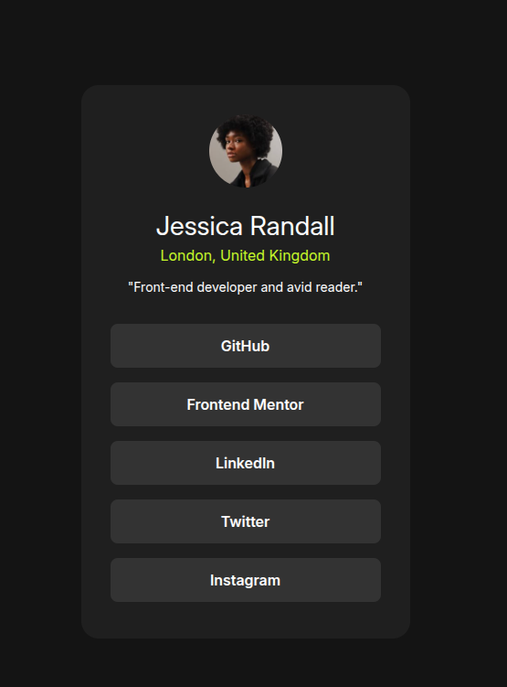

# Frontend Mentor - Social links profile solution

This is a solution to the [Social links profile challenge on Frontend Mentor](https://www.frontendmentor.io/challenges/social-links-profile-UG32l9m6dQ). Frontend Mentor challenges help you improve your coding skills by building realistic projects. 

## Table of contents

- [Overview](#overview)
  - [The challenge](#the-challenge)
  - [Screenshot](#screenshot)
  - [Links](#links)
- [My process](#my-process)
  - [Built with](#built-with)
  - [What I learned](#what-i-learned)
  - [Continued development](#continued-development)
  - [Useful resources](#useful-resources)
  - [AI Collaboration](#ai-collaboration)
- [Author](#author)
- [Acknowledgments](#acknowledgments)

**Note: Delete this note and update the table of contents based on what sections you keep.**

## Overview

### The challenge

Users should be able to:

- See hover and focus states for all interactive elements on the page

### Screenshot

### Links

- Solution URL: [Add solution URL here](https://your-solution-url.com)
- Live Site URL: [Add live site URL here](https://your-live-site-url.com)

## My process

### Built with

- Semantic HTML5 markup
- CSS custom properties
- Flexbox
- Sass/SCSS

### What I learned

- **rem vs px conversions are easy to get wrong.** I initially assumed 14px equalled 1rem, but the browser default is actually 16px = 1rem. Now I always double check by dividing the target px value by 16 instead of guessing.
- **Not every element needs its own `max-width`.** I had a `max-width` set on a link that could never actually be reached, because its parent was already constraining the width and the link was set to `width: 100%`. It taught me to trace a property back through the parent chain before assuming it's necessary.
- **`box-sizing: border-box` affects where padding "fits."** When deciding whether to add padding to `body` or `article` to stop my card touching the screen edges on mobile, I reasoned that because of the border-box reset, padding on `article` would be absorbed into its `height: 100vh` rather than adding extra height to the page. Testing it confirmed that reasoning was right.

### Continued development

- Getting more confident and consistent with rem/px conversions, so I don't have to double-check every time.
- Getting better at tracing CSS properties through the parent/child chain to understand when a style is actually needed versus redundant.
- Building a better instinct for which elements actually need specific styling, rather than adding properties "just in case."

### Useful resources

### AI Collaboration

- I used Claude to check over my work once I'd already completed the challenge myself, rather than to build it.
- It reviewed my HTML and SCSS and asked me guiding questions instead of giving me fixes outright, which pushed me to find and fix issues (like a wrong rem conversion, a redundant `max-width`, and missing mobile padding) on my own.

## Author

- Frontend Mentor - [@JeremyCra](https://www.frontendmentor.io/profile/JeremyCra)

